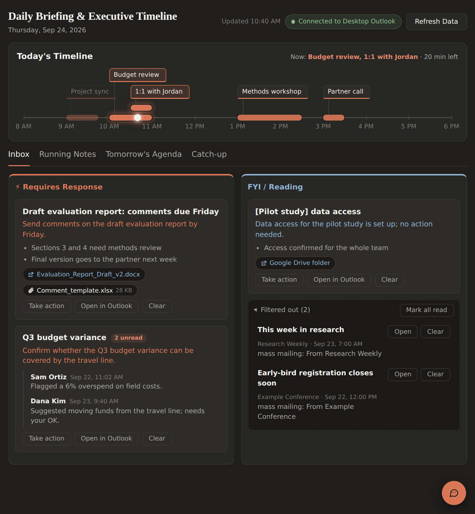
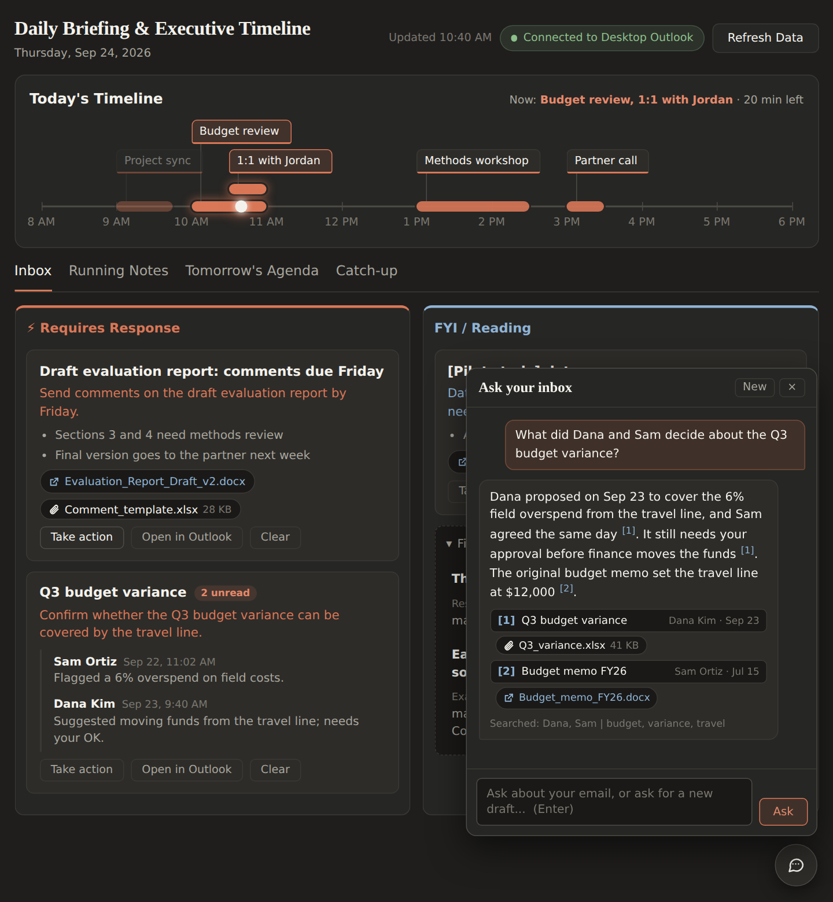

<p align="center"></p>

# Daily Briefing

A local Windows dashboard for classic Outlook. It shows today's meetings on a timeline, sorts your unread email into what needs a reply and what is FYI, drafts replies in your style, answers questions about past threads, and gives you a full rundown after time away.

Everything runs on your own PC. The AI is Claude, used through the Claude Code command-line tool and your own Claude subscription, so there is no API key and no separate billing.



## Features

- **Timeline.** Today's meetings on a single time axis from 8 AM to 6 PM. Overlapping meetings stack in their own rows. Past meetings fade, the current one glows, and a status line shows what is on now or next.
- **Triaged inbox.** Unread conversations, newest first, grouped by thread and summarized: **Requires Response** or **FYI**. Newsletters, marketing, and routine notices go to a collapsed **Filtered out** list. Journal decisions, revision requests, and reviewer invitations are always kept.
- **Links and attachments.** Shared documents (SharePoint, OneDrive, Google Docs and Drive, Teams, Zoom, and more) and real file attachments appear as one-click chips. Logos and signature images are skipped. Duplicates are merged.
- **Reply drafting.** Type an instruction and press Ctrl+Enter. A Reply All window opens in Outlook with a short, direct draft above the quoted thread. Nothing is ever sent for you.
- **Ask AI about a thread.** Press Enter to ask a question about a specific email thread.
- **Inbox assistant.** A chat box (Ctrl+K) that searches your Inbox, its subfolders, and Sent Items and answers with cited sources. It can also open a new email draft from a request like "Email Sam asking for the report by Friday".
- **Catch-up.** After two or more missed workdays, a banner offers a full rundown: what needs you now, deadlines, what happened by project, what was resolved without you, and the meetings you missed.
- **Running notes** with nested checklists, and **tomorrow's agenda**.
- **Clear** marks a whole conversation as read in Outlook.
- **Tray app.** Runs quietly in the system tray, can start with Windows, and shuts down (with Outlook) when you close the dashboard.



## Requirements

- Windows 10 or 11
- **Classic Outlook** for Windows. The new Outlook for Windows does not support the scripting interface this app uses.
- Google Chrome or Microsoft Edge
- **Claude Code**, signed in with a Claude account whose plan includes Claude Code
- Permission to run PowerShell scripts (most setups allow this; some IT policies block it)

## Install

1. Download this repository (green **Code** button, then **Download ZIP**) and unzip it somewhere permanent, for example `C:\Users\you\daily-briefing`.
2. Install Claude Code if you do not have it. In PowerShell:
   ```powershell
   irm https://claude.ai/install.ps1 | iex
   claude
   ```
   Sign in with your Claude account when it asks, then type `/exit`.
3. Double-click **Install.cmd**. It will:
   - ask for your name, a one-line description, and your organization's email domain (saved in `settings.json`)
   - check for classic Outlook, Chrome or Edge, and Claude Code
   - build `DailyBriefing.exe` with the C# compiler that ships with Windows
   - add Start menu and desktop shortcuts (to start it automatically at sign-in, use **Start with Windows** in the tray menu)
4. Open **Daily Briefing** from the Start menu. To pin it, right-click it in Start and choose **Pin to taskbar**.

Run **Install.cmd** again any time after updating the files. It is safe to repeat. **Uninstall.cmd** removes the shortcuts and the .exe and keeps your data.

## Everyday use

| Where | What |
|---|---|
| Email card | **Take action** opens the instruction box. **Enter** asks AI about the thread, **Ctrl+Enter** drafts a Reply All, **Shift+Enter** adds a new line. |
| Email card | **Open in Outlook**, **Clear** (marks the conversation read), attachment and link chips |
| Anywhere | **Ctrl+K** opens the inbox assistant. **Esc** closes it. |
| Tray icon | Double-click opens the dashboard. Right-click: Open Dashboard, View Log, Start with Windows, Restart Server, Exit. |

Draft instructions starting with **informal** give a short message with no greeting or sign-off. Anything else is formal and ends with your sign-off.

The dashboard refreshes every 15 minutes. Summaries are cached, so a refresh only sends new or changed threads to Claude.

## Settings

Your personal settings live in `settings.json` (created by the installer; see `settings.example.json`):

| Setting | Meaning |
|---|---|
| `UserName`, `SignName`, `SignOff` | How drafts address and sign for you |
| `UserDescription` | One line of context for the AI, such as your role and organization |
| `InternalDomains` | Your organization's email domains. Mail from these senders is never pre-filtered. |
| `ClaudeModel`, `AssistantModel`, `CatchupModel` | `haiku` (fastest), `sonnet` (better answers), or `opus` |
| `CloseOutlookOnExit` | Quit Outlook when the dashboard closes (never while a draft window is open) |
| `Port` | Local port, 8000 by default |

Restart from the tray menu after changing settings. Advanced options (batch sizes, timeouts, filters) are at the top of `app/server.ps1`.

## Privacy

- The app only listens on `localhost`. Nothing is exposed to your network.
- Email text is sent to Claude through your own Claude account when threads are summarized, drafted, searched, or caught up on. Check that this fits your organization's data policy.
- Your notes, summary cache, catch-up results, and logs stay in `data\`, and `settings.json` holds your personal details. Both are excluded from Git by `.gitignore`.
- Drafts are never sent automatically.

## Troubleshooting

- **Cards say "AI summary unavailable"**: Claude Code is not signed in or timed out. Run `claude` in PowerShell once, then **Restart Server** from the tray.
- **"The server did not start"**: open `data\server.log`. If PowerShell scripts are blocked on your PC, ask IT about script execution.
- **Nothing happens when drafting**: the Reply All window may have opened behind the dashboard. Check the Outlook icon on the taskbar.
- **The log**: right-click the tray icon, then **View Log**.

## Project layout

```
Install.cmd / Install.ps1        setup (safe to re-run)
Uninstall.cmd / Uninstall.ps1    removes shortcuts and the .exe
settings.example.json            template for settings.json
app/
  server.ps1                     local server, Outlook access, Claude calls, tray icon
  Index.html                     the dashboard
  launcher.cs                    source for DailyBriefing.exe
  launch.vbs                     fallback launcher if the .exe cannot be built
  icons/                         app icons
docs/screenshots/                README images (sample data only)
data/                            created on first run: notes, caches, logs (not in Git)
```
